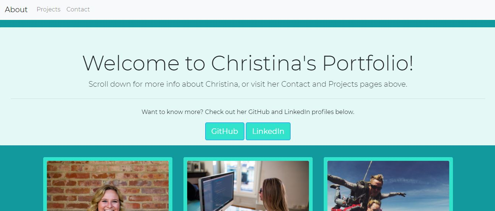
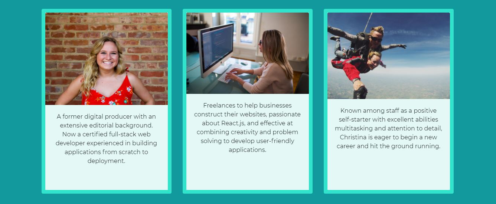
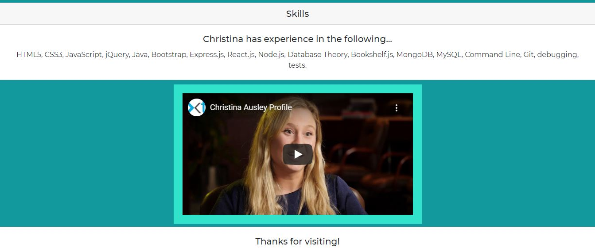
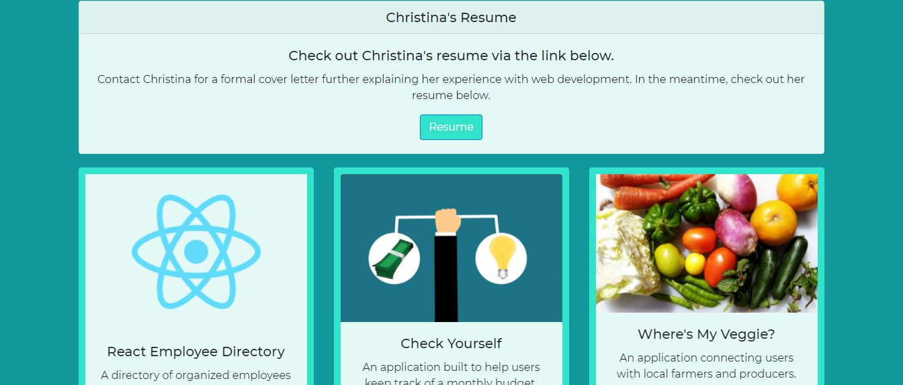

# React Portfolio

## Description

For this project, I created my own personal portfolio using React.js.

I'm passionate about front end web development, and enjoyed showcasing my own talents through a particular passion: React.js

## Table of Contents
- [React Portfolio](#react-portfolio)
  - [Description](#description)
  - [Table of Contents](#table-of-contents)
  - [Usage](#usage)
  - [Finished Product](#finished-product)
  - [Technologies](#technologies)
  - [Questions](#questions)
  - [Learn More](#learn-more)

## Usage
Visit the deployed Heroku link [here.](https://react-directory-ausley.herokuapp.com/)

Learn more about me!

## Finished Product
View the deployed application via Heroku [here.](https://ausley-resume.herokuapp.com/)

View a brief demo of the portfolio [here:](https://youtu.be/oRSzFiCByxU)

## Technologies
* HTML
* Bootstrap
* CSS
* Animate.css
* JavaScript
* React.js
* JSON
* Create React App

## Questions
​
If you have any questions about me and my portfolio, please contact me:

On GitHub: [cmausley](https://github.com/cmausley) | Via Email: christinamausley@gmail.com

## Learn More

This project was bootstrapped with [Create React App](https://github.com/facebook/create-react-app).

You can learn more in the [Create React App documentation](https://facebook.github.io/create-react-app/docs/getting-started).

To learn React, check out the [React documentation](https://reactjs.org/).